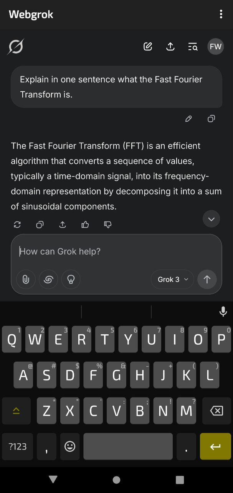

# Webgrok 
A display for Grok's mobile web application. "Tinfoil for Grok" if you will. This was done
to port access to Grok to Android devices which aren't able to install the official Grok app, or
those who may want to access it in a different way.

### Under the hood
The application uses Mozilla's `geckoview` to package the webpage and manage state. This ensures
better compatibility as the application contains a full runtime from Mozilla rather than rendering 
the web page via whichever installed `webview` a user may be stuck with on their system. 

### Privacy
No data is collected by this application other than normal cached web content. Any interaction with 
the underlying website is between the user and the website. 

### What's it look like?

<div style="display: flex; justify-content: space-between;"> 
  
</div>

### Releases
- Run ```adb shell getprop ro.product.cpu.abi``` to determine your CPU architecture.
- Grab APK from [here](https://github.com/steadfastengineering/grokweb/releases/latest) for your device.

### TODOs:
- Launch intent for internet browser for any links that are not root or valid grok links.
- Add feature for uploading documents to grok.  
- Add feature to save images and things to local storage that are generated.

### Bugs: 
- When building with minifyEnabled=true, the app crashes with a fatal error. Possible related to:
  - Missing `libmagtsync.so`
  - Javascript error: `resource://gre/modules/addons/XPIInstall.sys.mjs`
  - TODO: Resolve all runtime errors due to minifyEnable and shrink application size.

### License
This project is licensed under the MIT License.
